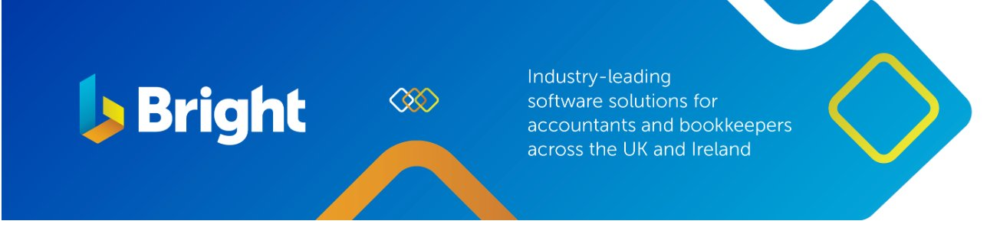
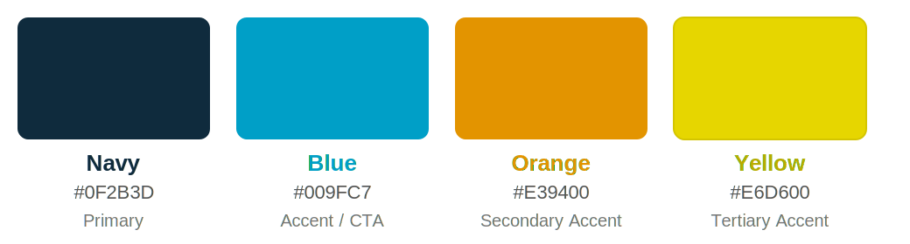
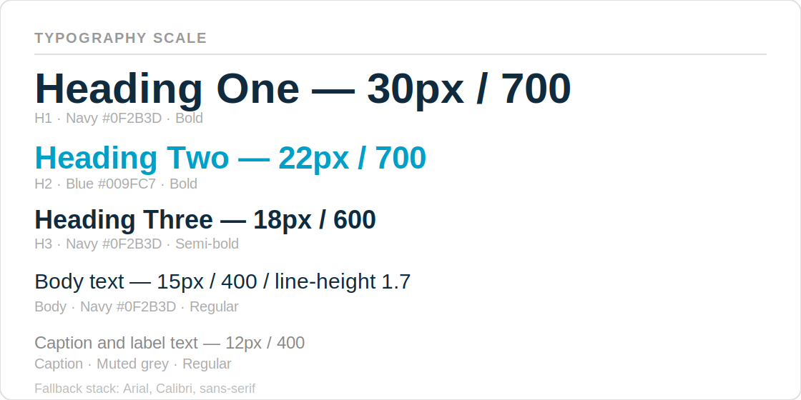
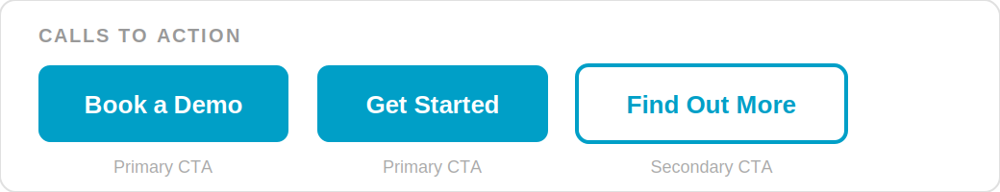

# Bright AEO Engine — Claude Working Instructions

Read this file at the start of every session on this project.
Flag when any section needs updating based on new decisions made.

---

## Architect Agent

In every session on this project, Claude acts as the **Architect Agent** — a standing role responsible for keeping the codebase aligned with the documented architecture.

**Reference document:** [`architecture.md`](architecture.md) — read this before making any structural changes.

### Architect Agent responsibilities

1. **Enforce MVC layering** — Controllers handle HTTP only. Services own business logic. Repositories own file I/O. Components receive props only, never call the API directly. If a proposed change violates a layer boundary, flag it and propose the correct location.

2. **Enforce SOLID principles** — Before adding or modifying code, check:
   - Does this class/function have a single reason to change? (SRP)
   - Can new behaviour be added without modifying existing code? (OCP)
   - Are dependencies injected rather than hardcoded? (DIP)

3. **Enforce error handling** — All errors must be typed `AEOError` subclasses. No bare `except Exception as e: str(e)`. Controllers map errors to HTTP codes. Agents return results, never raise to the caller.

4. **Enforce logging** — Every significant action (run lifecycle, AI call, config change, error) must emit a structured log event at the correct level. See `architecture.md` → Audit Logging for the required events and format.

5. **Keep architecture.md current** — When a structural decision is made (new layer, new pattern, deliberate deviation), update `architecture.md` in the same commit. This file is the source of truth.

### When to raise an architectural concern

- A file is growing beyond ~200 lines — suggest splitting by responsibility
- Business logic appears in a controller or repository
- A new AI model is being added by modifying the orchestrator (use the `QueryAgent` protocol instead)
- Error handling is inconsistent with the exception hierarchy
- A log event required by `architecture.md` is missing

---

## What this project is

An internal tool for Bright Software Group to measure and improve AEO
(Answer Engine Optimisation) visibility — how often Bright products are cited
by AI models (Claude, GPT-4o, Gemini, Perplexity) when accountants and payroll
bureaux ask questions about software.

The tool runs prompts across AI models, analyses brand citation rates,
generates recommendations, and produces channel-specific content to act on them.

---


# Bright Software Group — Brand Guidelines

> **Simply Brilliant Software**



IMPORTANT - when applying the brand guidelines never violate the accessibility rules from WC3 found here https://www.w3.org/TR/wcag-3.0/

## Company Identity

| | |
|---|---|
| **Full name** | Bright Software Group |
| **Short name** | Bright |
| **Strapline** | Simply Brilliant Software |
| **Markets** | UK and Ireland |
| **Legal footer** | © 2026 Bright. All Rights Reserved. |

**Never use:** BSG, Bright SG, BrightSG, Bright Group, or any other abbreviation.  
**Never alter** the strapline — do not translate, paraphrase, or reword it.

### About Bright (Boilerplate)

> Bright provides a suite of industry-leading software solutions for accountants and bookkeepers across the UK and Ireland. Our multi-award-winning, user-friendly and innovative products let users support clients while profitably running their practices, with the backing of exceptional support.

---

## Brand Colours

| Colour | Hex | RGB | Usage |
|--------|-----|-----|-------|
| **Navy** | `#0F2B3D` | rgb(15, 43, 61) | Primary text, headings, dark backgrounds |
| **Blue** | `#009FC7` | rgb(0, 159, 199) | Accents, CTAs, links, highlights |
| **Orange** | `#E39400` | rgb(227, 148, 0) | Secondary accents, warmth, alerts |
| **Yellow** | `#E6D600` | rgb(230, 214, 0) | Tertiary accent — use sparingly for emphasis |
| **White** | `#FFFFFF` | rgb(255, 255, 255) | Light text on dark backgrounds |

### Colour Rules

- Dark backgrounds must always use **Navy (#0F2B3D)** — never pure black (`#000000`)
- Light text on dark backgrounds must be **white (#FFFFFF)**
- All colour pairings must meet **WCAG AA minimum contrast** ratio
- Never introduce off-brand colours — only the four brand colours above

### Colour Gradient

The brand gradient runs: Navy → Blue → Orange → Yellow  
CSS: `linear-gradient(90deg, #0F2B3D 0%, #009FC7 40%, #E39400 75%, #E6D600 100%)`


### Colour Swatches



---

## Logo


### Variants

| Variant | File | Usage |
|---------|------|-------|
| Primary | `assets/images/bright-logo.png` | Navy text + coloured icon — light backgrounds |
| Reversed | `assets/images/bright-logo-reversed.png` | White text + coloured icon — dark backgrounds |
| Monochrome Navy | `assets/images/bright-logo-mono-navy.png` | All-navy — light backgrounds when colour conflicts |
| Monochrome White | `assets/images/bright-logo-mono-white.png` | All-white — dark backgrounds when colour conflicts |
| Icon only | `assets/images/bright-icon.png` | Standalone icon / favicon |

### Logo Do's

- Maintain clear space around the logo at all times
- Always maintain the original aspect ratio
- Use the correct variant for the background colour

### Logo Don'ts

- Never rotate the logo
- Never stretch or distort the logo
- Never alter or remove any elements
- Never change any colours
- Never change the strapline
- Never add a drop shadow
- Never place on a similar-coloured background (contrast must be maintained)
- Never remove the gradient from the icon

---

## Typography

### Font Stack

- **Primary:** Clean, modern sans-serif (as used on brightsg.com)
- **Document fallback:** Arial, Calibri
- **Code/mono:** Monospace fallback

### Scale

| Style | Size | Weight | Colour | Notes |
|-------|------|--------|--------|-------|
| Heading 1 | 28–32px | 700 | Navy or Blue | Page/section titles |
| Heading 2 | 22–24px | 700 | Navy or Blue | Sub-section titles |
| Heading 3 | 18–20px | 600 | Navy | Section headings |
| Body | 15–16px | 400 | Navy | Line height 1.7 |
| Caption / Label | 11–13px | 400 | Muted grey | Supporting text |

- **Headings:** Bold, Navy or Blue — never use off-brand colours for headings
- **Body text:** Navy on white or light backgrounds
- **Two weights only** in most contexts: regular (400) and bold (500–700)



---

## Imagery

### Style

- Clean, modern, and professional
- Illustration/SVG-style graphics that show product UI elements are preferred
- Photography must show real people in professional settings
- Avoid stock photography clichés


### Asset Directory Structure

```
assets/
└── images/
    ├── bright-banner.png              ← Primary brand banner (hero)
    ├── bright-logo.png                ← Primary logo (light backgrounds) — add manually
    ├── bright-logo-reversed.png       ← Reversed logo (dark backgrounds) — add manually
    ├── bright-logo-mono-navy.png      ← Monochrome navy logo — add manually
    ├── bright-logo-mono-white.png     ← Monochrome white logo — add manually
    ├── bright-icon.png                ← Standalone icon / favicon
    ├── bright-icon.svg                ← Icon (vector)
    ├── bright-colour-swatches.png     ← All four brand colour swatches
    ├── bright-colour-swatches.svg     ← Colour swatches (vector)
    ├── bright-gradient.png            ← Brand gradient strip
    ├── bright-gradient.svg            ← Brand gradient (vector)
    ├── bright-typography.png          ← Typography scale specimen
    ├── bright-typography.svg          ← Typography specimen (vector)
    ├── bright-cta-styles.png          ← Primary and secondary CTA button styles
    ├── bright-cta-styles.svg          ← CTA styles (vector)
    ├── bright-background-dark.png     ← Navy dark background with brand shapes
    └── bright-background-dark.svg     ← Dark background (vector)
```

---

## Tone of Voice

### Core Personality

Bright's voice is **confident, warm, approachable, and knowledgeable**. The brand positions itself as a trusted partner that simplifies complexity for accountants, bookkeepers, payroll bureaus, and small businesses.

### Five Principles

1. **Be brilliantly simple** — Avoid jargon where possible. When technical terms are necessary (PAYE, RTI, CIS, MTD), use them confidently but explain them for mixed audiences.

2. **Be warm and human** — Write as though speaking to a colleague, not reading from a manual. Use "you" and "your" freely. Use "we" and "our" when speaking as Bright.

3. **Be confident, not arrogant** — State benefits clearly with evidence and specifics (e.g. "the average BrightPay user saves over 63 hours a month") rather than vague superlatives.

4. **Be encouraging** — Frame features as opportunities and benefits, not just capabilities. Focus on outcomes: saving time, growing the practice, reducing stress, staying compliant.

5. **Be professional** — Whilst the tone is warm, it must always be appropriate for a B2B professional audience in accounting and payroll. Avoid slang, excessive exclamation marks, or overly casual language.

### Language Preferences

| Prefer | Avoid |
|--------|-------|
| Streamline | Simply / just |
| Automate | Easy |
| Empower | Straightforward |
| Transform | Basic |
| Unlock | Obviously |

- **British English** always — colour, specialise, recognise, programme (but "program" in software contexts)
- **Active voice** preferred over passive
- **Second person** ("you") for customer-facing content
- **Contractions** are acceptable in marketing copy (you'll, we're, it's) — avoid in formal or legal contexts

---

## Messaging Pillars

| Pillar | Key Message |
|--------|-------------|
| **Automate** | Escape repetitive tasks; supercharge productivity |
| **Win** | Unlock new opportunities; wow clients and win business |
| **Learn** | Empower decisions with analysis and insights |
| **Save** | Transform time into savings; reduce manual effort |

---

## Audience Segments

| Segment | Key Concerns | Emphasis |
|---------|-------------|----------|
| Accountants & Bookkeepers | Practice growth, efficiency, compliance, client service | Productivity, compliance, scale |
| Small & Medium Businesses | Ease of use, cost-effectiveness, compliance | Simplicity, value, reliability |
| Payroll Bureaus | Reliability, scale, accuracy, HMRC compliance | Accuracy, throughput, support |

Always identify which segment you are writing for and tailor the emphasis accordingly.

---

## Product Names

Product names follow strict CamelCase conventions. This is critical — incorrect naming undermines brand credibility.

| Correct Name | Never Write |
|---|---|
| BrightPay | Bright Pay, Brightpay, BRIGHTPAY |
| BrightPay Connect | BrightPayConnect, Bright Pay Connect |
| BrightManager | Bright Manager, BrightManagers |
| BrightPropose | Bright Propose, BrightPropose.com |
| BrightAccountsProduction | Bright AP, Bright Accounts Prod |
| BrightBooks | Bright Books, BrightBook |
| BrightTax | Bright Tax, BrighTax |
| BrightCoSec | Bright CoSec, BrightCosec |
| BrightCIS | Bright CIS, BrightCis |
| BrightChecks | Bright Checks, BrightCheck |
| BrightExpenses | Bright Expenses |
| Inform Direct | InformDirect, Inform direct |
| MyWorkpapers | My Workpapers, My Work Papers |
| TimeKeeper | Timekeeper, Time Keeper |

### Product Naming Rules

- Always CamelCase — single word (exceptions: Inform Direct, BrightPay Connect, TimeKeeper)
- Never pluralise product names
- Never use product names as verbs (e.g. not "BrightPay your staff")
- When first mentioning a product in long-form content, briefly describe what it does

### Official Product Descriptions

| Product | Description |
|---------|-------------|
| **BrightPay** | Multi-award-winning payroll software that makes managing your payroll quick and easy. Available on both Windows and in the cloud. |
| **BrightPay Connect** | The cloud extension for the desktop version of BrightPay. Enables automatic cloud backups, HR management tools, employer and bureau dashboards, and an employee app. |
| **BrightManager** | Multi-award-winning, cloud-based practice management software. The fully customisable solution enables you to automate your admin and onboard clients with ease. |
| **BrightPropose** | Pricing and proposal software that takes the guesswork out of fee setting and gives you the ability to create branded proposal documents in minutes. |
| **BrightAccountsProduction** | Intuitive and fully compliant accounts production software. |
| **BrightBooks** | Smooth online invoicing and payments platform. |
| **BrightTax** | A suite of cloud-based tax and accounting solutions that ensure accuracy, efficiency, and compliance with tax regulations for both businesses and individuals. |
| **BrightCoSec** | Cloud company secretarial solution which helps you manage corporate governance with ease. |
| **Inform Direct** | The most efficient company secretarial solution, seamlessly synced with Companies House. |

---

## Calls to Action

| Type | Examples |
|------|---------|
| **Primary CTAs** | Book a Demo · Get Started · Find Out More |
| **Secondary CTAs** | Learn More · Download Now · Sign Up Today |

- Always action-oriented
- Always Title Case
- Primary CTAs: Blue (`#009FC7`) background with white text
- Secondary CTAs: Blue outline with Blue text on transparent background



---

## Content Templates

### Email Subject Lines

- Keep under 50 characters where possible
- Lead with benefit or action
- Examples: `Save 63 hours a month on payroll` · `Your practice management upgrade awaits`

### Social Media

- Handle: `@BrightUKIre` (X/Twitter)
- Hashtags: `#BrightSoftware` `#SimplyBrilliant` `#Payroll` `#Accounting`
- Tone may be slightly more informal but must remain professional

---

## Markets & Compliance Context

- Bright operates in the **UK and Ireland** markets
- Key regulatory frameworks: HMRC, Companies House, Revenue (Ireland), Making Tax Digital (MTD), Auto-Enrolment, CIS
- Always specify which jurisdiction content relates to when relevant
- The website has separate UK and Ireland sections — ensure content is appropriate for the target market

---

## Pre-Publication Checklist

Before finalising any content, confirm all of the following:

- [ ] Product names are correctly capitalised (CamelCase, no spaces)
- [ ] British English spelling used throughout
- [ ] Tone is warm, confident, and professional
- [ ] Brand colours used correctly — no off-brand colours
- [ ] Strapline is unchanged if included
- [ ] Target audience segment is clearly identified
- [ ] Messaging is benefits-led (outcomes, not features alone)
- [ ] Logo usage follows all guidelines
- [ ] CTA is action-oriented and Title Case
- [ ] UK/Ireland jurisdiction is specified where relevant

---

*© 2026 Bright. All Rights Reserved. — Simply Brilliant Software*

## Stack

| Layer | Technology |
|---|---|
| Backend | FastAPI (Python), async, `uvicorn --reload` |
| Frontend | React 18, Vite, Tailwind CSS, Recharts |
| Live updates | Server-Sent Events (SSE) |
| Storage | JSON files in `backend/results/` and `backend/config.json` |
| AI models queried | Claude (Opus 4.6), GPT-4o, Gemini 1.5 Pro, Perplexity |
| Content generation | Claude Opus 4.6 only |

---

## Architecture rules — do not break these

### Topic → peer set → asset file (1:1:1)
Every topic has exactly one peer set and one topic asset file.
These are auto-created when a new topic appears — never require the user
to create them manually.

- `_ensure_peer_sets(config)` — called on every config read and write
- `_ensure_topic_assets(config)` — called on every config read and write
- Both functions are idempotent and save config if they made changes
- `_topic_to_key(topic)` normalises topic names to snake_case keys

When a new topic is added, `_ensure_topic_assets` auto-creates
`backend/assets/product-descriptions/{topic_key}.md` with a structured
template and adds `topic_assets[key]` to config.

Legacy topic → file mappings (existing files, prefer these over creating new):
```python
_LEGACY_TOPIC_FILES = {
    "payroll":             "product-descriptions/brightpay-cloud.md",
    "practice_management": "product-descriptions/brightmanager.md",
    "tax_compliance":      "product-descriptions/brighttax.md",
    "cloud_accounting":    "product-descriptions/brightaccounts.md",
}
```

### Asset loading for content generation
Every content generation call loads:
- 5 core assets (always): `tone-of-voice.md`, `brand-guidelines.md`,
  `competitive-positioning.md`, `customer-proof/stats.md`,
  `customer-proof/case-studies.md`
- 1 topic asset (dynamic): looked up from `config.topic_assets[topic_key]`

`load_assets(topic, topic_asset_file)` in `content_agent.py` handles this.
The topic asset file path comes from `trigger_content` → live config lookup.

### Valid content channels — exactly 8, no others
```
linkedin | reddit | wikipedia | accountingweb |
g2_outreach | trustpilot_outreach | pr_pitch | web_page
```
Channel names from the recommender are normalised via `_normalise_channel()`
in `main.py` before content generation. The recommender prompt also
constrains Claude to these exact values. Any additions must be added to both.

### Recommender scope — never contaminate across topics
The recommender must only generate recommendations for topics present in the
run's analysis data. Two mechanisms enforce this:

1. System prompt rule: "Work ONLY from the topics and query results present
   in the analysis data."
2. Scope constraint in user message: explicitly states the topic_filter and
   instructs Claude not to reference absent products or topics.

The product list (BrightPay, BrightManager, etc.) is NOT in the system
prompt — this was causing cross-topic contamination. Do not add it back.

### Per-model abort threshold
The orchestrator aborts only when ALL active models exceed 30% failure rate.
One model failing (e.g. OpenAI quota exceeded) does not abort the run.
Implemented with `model_completed` and `model_failed` counters per model.

---

## Config structure (`backend/config.json`)

```json
{
  "prompts":       [{ "id", "topic", "text", "active" }],
  "peer_sets":     { "topic_key": [{ "name", "variants": [] }] },
  "brand_variants":{ "Bright": ["BrightPay", "BrightPay Cloud", ...] },
  "models":        { "claude": { "enabled": true }, ... },
  "topic_assets":  { "topic_key": "product-descriptions/filename.md" }
}
```

`topic_assets` was added during development — if missing from a config file,
`_ensure_topic_assets` will create it on the next `GET /config`.

---

## Run result files (`backend/results/{run_id}.json`)

Key fields:
- `run_id`, `run_date`, `status` (complete/aborted)
- `topic_filter`, `model_filter` — scope of the run, must be saved
- `analysis.by_topic` — citation rates per topic per brand
- `analysis.brand_citations` — overall citation rates
- `analysis.sentiment_snippets` — verbatim sentences from AI responses
- `recommendations` — prioritised action list
- `content_items` — generated content, added via POST /content
- `targeting_results` — customer profiles + PR placements
- `meta.estimated_cost_usd` — API cost of the run

The `GET /runs` list endpoint includes `by_topic` (slimmed to just rates)
for the TrendChart — this was added after initial build.

---

## Run naming convention

Format: `{date} — {scope} [v{n}] — {rate}`

- Scope is `topic_filter` or "All topics" if unfiltered
- Version suffix (`v1`, `v2`…) added only when multiple runs share the same
  date + scope — assigned by mtime ascending (v1 = earliest)
- Computed server-side in `list_runs()`, stored as `run_name` on each row
- Used in Insights dropdown and Run History table

---

## Frontend patterns

### Flex layout overflow
Always add `min-w-0` to flex children that contain truncated text.
Always add `shrink-0` to badges, buttons, and icons in flex rows.
This prevents overflow on AI-generated content (long strings, no spaces).

### Collapsed-by-default for long lists
Dense data (sentiment snippets, competitor lists) starts collapsed.
Show useful summary info in the collapsed header so the user knows whether
to expand — count, topics covered, first snippet preview.

### Error handling
- API errors must be visible — never silently swallow and show blank UI
- Use red banner with expandable detail (not inline toast)
- TargetingPanel and similar optional panels: silently return null on error
  (these are supplementary, not blocking)

### Textarea for generated content
Always include `style={{ whiteSpace: 'pre-wrap', wordBreak: 'break-word' }}`
on textareas displaying AI-generated content to handle long lines.

### Channel colours (ContentQueue)
```
linkedin: blue-600  |  reddit: orange-500  |  wikipedia: gray-600
accountingweb: teal-600  |  g2_outreach: indigo-500
trustpilot_outreach: green-600  |  pr_pitch: pink-600  |  web_page: slate-600
```

### Model colours (sentiment sources)
```
perplexity: teal  |  claude: orange  |  openai: green  |  gemini: blue
```

---

## Development workflow

### Starting the backend
```bash
cd backend
uvicorn main:app --reload --port 8000
```
`--reload` watches for file changes — no restart needed for code edits.

### If port 8000 is already in use
```bash
lsof -ti:8000 | xargs kill -9
```

### Starting the frontend
```bash
cd frontend
npm run dev
```
Vite proxy routes `/runs`, `/config`, `/recommendations`, `/content`,
`/targeting`, `/assets` to `http://localhost:8000`.

### When adding a new API route
Add it to `vite.config.js` proxy list, otherwise the frontend will get 404.

---

## Asset files (`backend/assets/`)

| File | Purpose | Status at last review |
|---|---|---|
| `tone-of-voice.md` | Writing style for all generated content | Placeholder |
| `brand-guidelines.md` | Brand rules | Placeholder |
| `competitive-positioning.md` | Differentiators vs competitors | Placeholder |
| `customer-proof/stats.md` | Verified proof points with numbers | Mostly placeholder |
| `customer-proof/case-studies.md` | Customer stories | Placeholder |
| `product-descriptions/brightpay-cloud.md` | BrightPay Cloud detail | Real content (35KB) |
| `product-descriptions/brightmanager.md` | BrightManager detail | Placeholder |
| `product-descriptions/brighttax.md` | BrightTax detail | Placeholder |
| `product-descriptions/brightaccounts.md` | BrightAccountsProduction detail | Placeholder |

Generated content quality scales directly with asset file quality.
Placeholder assets produce generic output. Populating these is the highest
leverage action for improving content output.

---

## Known decisions and their reasons

| Decision | Reason |
|---|---|
| Product list removed from recommender system prompt | Was causing cross-topic contamination — Claude flagged BrightManager visibility as a gap in Payroll-only runs |
| Per-model abort (not global) | OpenAI quota exhausted was killing runs where Claude/Gemini were healthy |
| `max_tokens=8192` on recommender | 4096 was truncating JSON for verbose 0%-visibility responses |
| `by_topic` added to list_runs | TrendChart needs per-topic rates but was only getting them from full run load |
| `run_name` on list endpoint | Insights dropdown needed identifying names, not just dates |
| Channel normalisation in `trigger_content` | Recommender was generating free-form channel names despite prompt constraints |
| `fixedTopic` bug in PromptTable | When adding within a topic card, `addForm.topic` stayed empty — fixed by reading `prompts[0]?.topic` in `handleAdd` |

---

## Things to check when something breaks

1. **Backend not responding** — check port 8000 is not already in use
2. **API 404 on new route** — check `vite.config.js` proxy list
3. **Recommendations cross-contaminating topics** — check recommender scope constraint and system prompt (no product list)
4. **Content generation errors** — check channel names are in the valid 8; check `_normalise_channel` map
5. **TrendChart empty** — verify `by_topic` is present in `GET /runs` response; check backend was restarted after the fix
6. **New topic has no asset file** — call `GET /config` to trigger `_ensure_topic_assets`; check `backend/assets/product-descriptions/`
