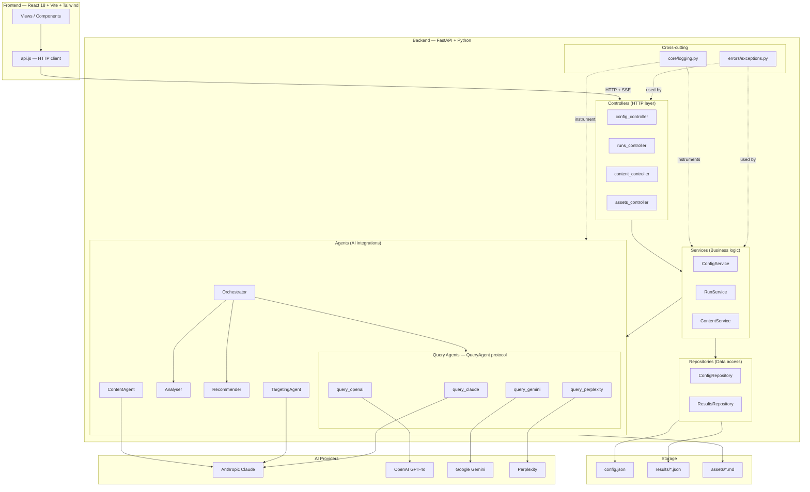
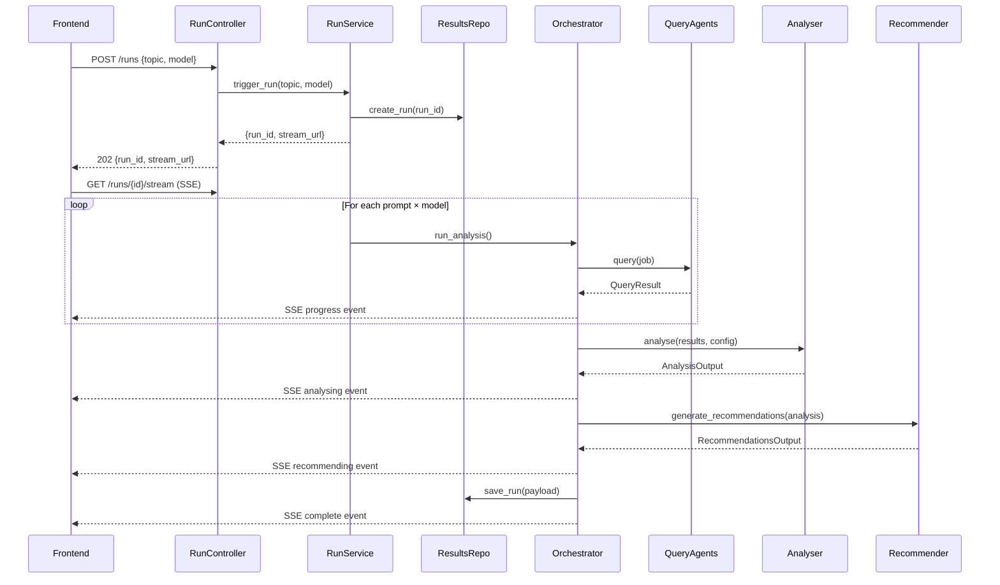

# Bright AEO Engine — Architecture

> This document is the authoritative reference for how this system is structured.
> All new code must conform to the patterns defined here.
> The Architect Agent in CLAUDE.md enforces this document in every session.

---

## System Overview



---

## Layer Definitions

### Model — `/backend/models/`
Data structures only. No logic, no I/O, no AI calls.

```
models/
├── query.py          # QueryJob, QueryResult
├── analysis.py       # AnalysisOutput, BrandCitation
├── recommendation.py # Recommendation, RecommendationsOutput
├── content.py        # ContentJob, ContentResult
└── targeting.py      # TargetingJob, CustomerProfile, PRPlacement, TargetingResult
```

**Rules:**
- Python `@dataclass` or Pydantic `BaseModel` only
- No imports from services, agents, or repositories
- No file I/O, no API calls

---

### Controller — `/backend/controllers/`
Thin HTTP handlers. Validate input, call one service method, return response. No business logic here.

```
controllers/
├── config_controller.py   # GET/POST/PUT/DELETE /config/*
├── runs_controller.py     # POST/GET /runs, GET /runs/{id}/stream
├── content_controller.py  # POST/GET/PUT /content, GET /recommendations, GET /targeting
└── assets_controller.py   # POST /assets/open
```

**Rules:**
- Each endpoint must be ≤ 20 lines
- Catch `AEOError` subclasses and map to HTTP status codes
- Never directly access the filesystem or call agents
- Never contain `if/else` business logic — move that to a service

---

### Service — `/backend/services/`
Owns all business logic, orchestration, and rules. Called by controllers, calls repositories and agents.

```
services/
├── config_service.py    # Config CRUD, peer set management, topic asset creation
├── run_service.py       # Run triggering, SSE streaming, result persistence
└── content_service.py  # Content generation, targeting, approval workflow
```

**Rules:**
- No FastAPI imports — services are framework-agnostic
- Raise `AEOError` subclasses on failure, never return error strings
- Log all significant actions via the logger (see Logging section)
- Receive repositories via constructor injection (not hardcoded paths)

---

### Repository — `/backend/repositories/`
All file I/O lives here. Services never touch the filesystem directly.

```
repositories/
├── config_repository.py   # Read/write config.json; holds async lock
└── results_repository.py  # Read/write/list results/*.json
```

**Rules:**
- One class per storage concern
- Raise `ConfigError` or `RunError` on missing files, never return None silently
- No business logic — pure read/write/list
- Injected into services, never imported directly by controllers

---

### Agent — `/backend/agents/`
AI integrations. Each query agent implements the `QueryAgent` protocol. Heavy AI logic (orchestrator, analyser, recommender) stays here.

```
agents/
├── protocols.py          # QueryAgent Protocol — the interface all query agents implement
├── orchestrator.py       # Coordinates a full run; dispatches jobs; manages semaphores
├── analyser.py           # Aggregates results into citation rates and watchouts
├── recommender.py        # Calls Claude to generate AEO recommendations
├── content_agent.py      # Generates channel-specific content via Claude
├── targeting_agent.py    # Generates customer profiles and PR placements via Claude
├── query_claude.py       # Implements QueryAgent — Anthropic API
├── query_openai.py       # Implements QueryAgent — OpenAI API
├── query_gemini.py       # Implements QueryAgent — Google API
└── query_perplexity.py   # Implements QueryAgent — Perplexity API
```

**QueryAgent Protocol (Open/Closed for new models):**
```python
from typing import Protocol
from models.query import QueryJob, QueryResult

class QueryAgent(Protocol):
    async def query(self, job: QueryJob) -> QueryResult: ...
```

Adding a new AI model = create a new file implementing `QueryAgent`. No changes to orchestrator.

**Rules:**
- Query agents: handle all API errors internally, always return a `QueryResult` (never raise)
- LLM agents (recommender, content, targeting): raise `LLMParseError` if response cannot be parsed
- Never import from controllers or services
- Never read/write config or results files directly

---

## SOLID Principles — Applied

| Principle | How it applies here |
|---|---|
| **Single Responsibility** | Each layer has one reason to change. Controller changes when HTTP contract changes. Service changes when business rules change. Repository changes when storage format changes. |
| **Open / Closed** | `QueryAgent` protocol: add a new AI model by adding a new file, never by modifying the orchestrator. New content channels: add to the normalisation map and channel handler, existing logic unchanged. |
| **Liskov Substitution** | All query agents are interchangeable via the `QueryAgent` protocol. The orchestrator only calls `.query(job)` — any conforming implementation works. |
| **Interface Segregation** | Services expose focused interfaces (ConfigService, RunService, ContentService). Controllers import only the service they need. No God classes. |
| **Dependency Inversion** | Services receive `ConfigRepository` and `ResultsRepository` via constructor injection. Controllers receive services via FastAPI `Depends()`. Concrete paths and file operations never hardcoded in business logic. |

---

## Error Handling

### Exception Hierarchy

```
AEOError (base — always has message + optional context dict)
├── ConfigError           → HTTP 400 / 404
│   ├── PromptNotFound
│   ├── CompetitorNotFound
│   └── PeerSetNotFound
├── RunError              → HTTP 404 / 422
│   ├── RunNotFound
│   ├── NoActivePrompts
│   └── NoActiveModels
├── ContentError          → HTTP 400 / 422
│   └── ChannelNotSupported
└── AgentError            → logged, run continues gracefully
    ├── QueryAgentError   → QueryResult(status="error")
    └── LLMParseError     → stored as *_error field in result file
```

### Rules

- **Controllers** catch `AEOError` subclasses and map to `HTTPException`. All other exceptions bubble up to FastAPI's default 500 handler.
- **Services** raise typed `AEOError` subclasses. Never return error strings or `None` to signal failure.
- **Agents** handle their own API errors internally. Query agents always return a `QueryResult`. LLM agents raise `LLMParseError` if the response can't be used.
- **Never** use bare `except Exception as e: str(e)` — always catch a specific type or re-raise as a typed `AEOError`.

### Controller pattern

```python
@router.post("/config/prompts", status_code=201)
async def add_prompt(prompt: dict, service: ConfigService = Depends(get_config_service)):
    try:
        return await service.add_prompt(prompt)
    except ConfigError as e:
        raise HTTPException(status_code=e.status_code, detail=str(e))
```

---

## Audit Logging

### Logger setup (`core/logging.py`)

```python
# Development: human-readable coloured output
# Production:  JSON lines (one log event per line, machine-parseable)

import logging
logger = logging.getLogger("aeo")
```

### Log levels

| Level | When to use |
|---|---|
| `DEBUG` | Per-query results, token counts, latency, cache hits |
| `INFO` | Run lifecycle events, phase transitions, completion summaries |
| `WARNING` | Single model failures, missing optional assets, retries |
| `ERROR` | Exceptions, LLM parse failures, file I/O errors |

### Required log events

Every log line must include a `context` dict. Use `logger.info("message", extra={"context": {...}})`.

| Event | Level | Required context fields |
|---|---|---|
| Run started | INFO | `run_id`, `total_jobs`, `models`, `topic_filter` |
| Query complete | DEBUG | `run_id`, `model`, `prompt[:60]`, `latency_ms`, `tokens_used`, `status` |
| Query failed | WARNING | `run_id`, `model`, `prompt[:60]`, `error` |
| Analysis complete | INFO | `run_id`, `total_responses`, `failed_calls`, `benchmark_rate` |
| Recommendations generated | INFO | `run_id`, `recommendation_count` |
| Recommendations failed | ERROR | `run_id`, `error`, `raw_response[:200]` |
| Content generated | INFO | `run_id`, `channel`, `word_count` |
| Content failed | ERROR | `run_id`, `channel`, `error` |
| Config changed | INFO | `change_type` (add_prompt / delete_competitor / etc.), `entity_id` |
| Run aborted | WARNING | `run_id`, `failed`, `completed`, `threshold` |

### Log format examples

```
# Development
2026-04-17 10:23:01 INFO  [run:abc123] Run started — 27 jobs models=[claude,gemini]
2026-04-17 10:23:04 DEBUG [run:abc123] Query ok — claude "best payroll software" 1840ms 2100tok
2026-04-17 10:23:05 WARN  [run:abc123] Query failed — openai "payroll bureau" QuotaExceeded
2026-04-17 10:23:41 INFO  [run:abc123] Analysis complete — 26/27 responses Bright=48%
2026-04-17 10:23:58 INFO  [run:abc123] Recommendations generated — 8 actions
2026-04-17 10:24:01 ERROR [content]    Channel linkedin failed — LLM returned empty string

# Production (JSON lines)
{"ts":"2026-04-17T10:23:01Z","level":"INFO","event":"run_started","run_id":"abc123","total_jobs":27,"models":["claude","gemini"]}
```

---

## Data Flow — Full Run



---

## Frontend MVC Mapping

| MVC Role | React equivalent | Examples |
|---|---|---|
| **Model** | API response shapes + `api.js` | `getRun()`, `getConfig()` — data only |
| **View** | Presentational components | `CompetitorRankings`, `SummaryCards`, `LiveFeed` |
| **Controller** | Tab components + event handlers | `Insights.jsx`, `Run.jsx`, `Configure.jsx` |

**Rules:**
- Tab components (`tabs/`) own state, load data, and pass props down. They are controllers.
- Component files (`components/`) receive props only — no direct API calls.
- `api.js` is the model layer — all HTTP calls go through it, nowhere else.

---

## Target File Structure

```
bright-aeo-engine/
├── backend/
│   ├── main.py                    # App factory + router registration (~50 lines)
│   ├── controllers/
│   │   ├── config_controller.py
│   │   ├── runs_controller.py
│   │   ├── content_controller.py
│   │   └── assets_controller.py
│   ├── services/
│   │   ├── config_service.py
│   │   ├── run_service.py
│   │   └── content_service.py
│   ├── repositories/
│   │   ├── config_repository.py
│   │   └── results_repository.py
│   ├── models/
│   │   ├── query.py
│   │   ├── analysis.py
│   │   ├── recommendation.py
│   │   ├── content.py
│   │   └── targeting.py
│   ├── agents/
│   │   ├── protocols.py           # QueryAgent Protocol
│   │   ├── orchestrator.py
│   │   ├── analyser.py
│   │   ├── recommender.py
│   │   ├── content_agent.py
│   │   ├── targeting_agent.py
│   │   ├── query_claude.py
│   │   ├── query_openai.py
│   │   ├── query_gemini.py
│   │   └── query_perplexity.py
│   ├── errors/
│   │   └── exceptions.py
│   ├── core/
│   │   └── logging.py
│   ├── assets/
│   ├── results/
│   └── requirements.txt
└── frontend/
    ├── src/
    │   ├── tabs/                  # Controllers — own state and data loading
    │   ├── components/            # Views — props only, no API calls
    │   └── api.js                 # Model — all HTTP calls
    └── ...
```

---

## Refactoring Phases

| Phase | What | Files affected | Risk |
|---|---|---|---|
| 1 | **Logging** — add `core/logging.py`, instrument agents and main.py | New file + existing agents | Low |
| 2 | **Exceptions** — add `errors/exceptions.py`, replace bare except | New file + agents + main.py | Low |
| 3 | **Repositories** — extract file I/O from main.py | New files + main.py | Medium |
| 4 | **Services** — extract business logic from main.py | New files + main.py | Medium |
| 5 | **Controllers** — split routes into controller modules | New files + main.py shrinks to ~50 lines | Medium |
| 6 | **Agent protocol** — add `protocols.py`, register agents dynamically | New file + orchestrator | Low |

Each phase is independently deployable. Complete and commit each before starting the next.

---

*Maintained by the Architect Agent — see CLAUDE.md for enforcement rules.*
